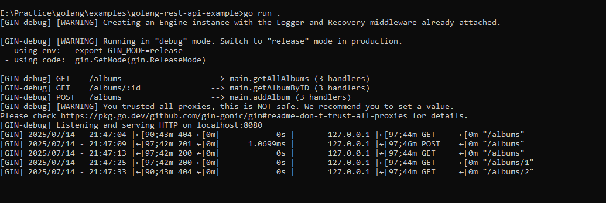
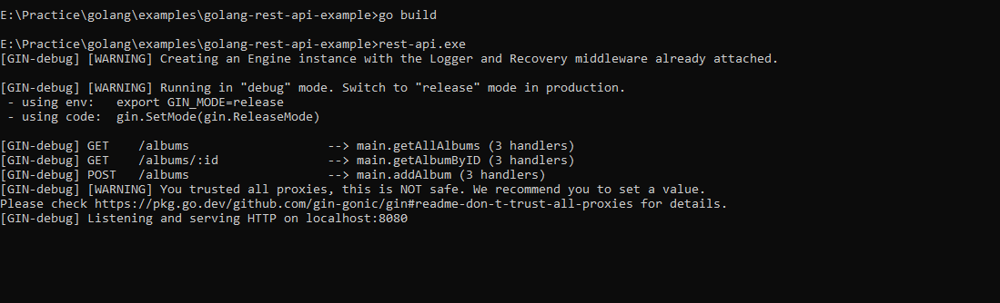
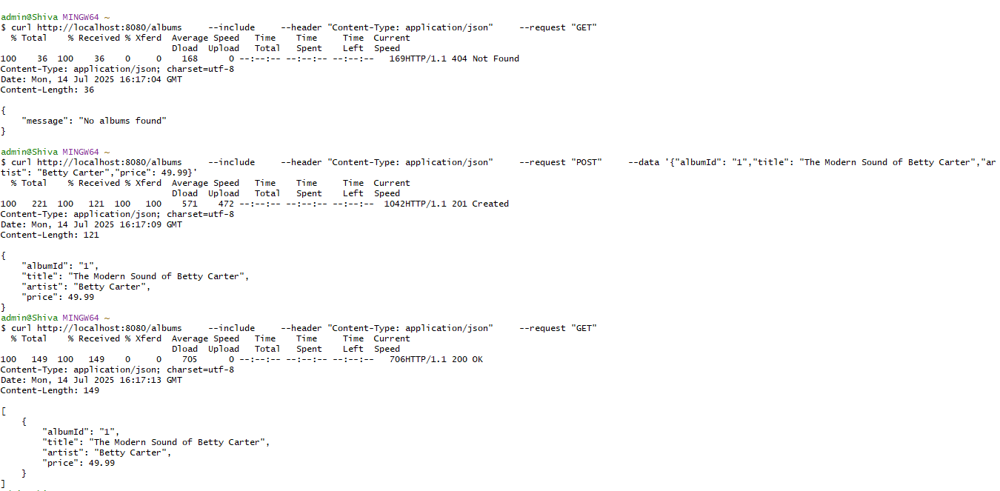
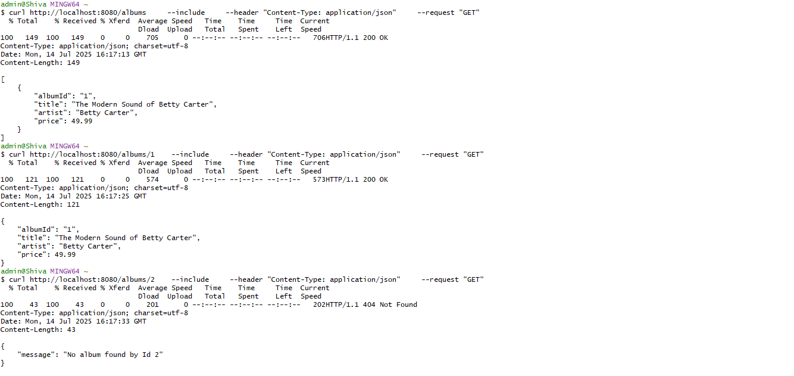

# Golang-rest-api-example

### This appilication demonstrates that how developer can develop and rest based application in golang with gin routine library.

### Prerequisites
1. Golang https://go.dev/doc/install

### How to Run
execute below command on terminal to run the application, it will download all the required libraries mentioned in go.mod file and bootup the application.

    go run .

### How to Test
 Below curls can be executed on git bash or terminal to hit the rest endpoints

    curl http://localhost:8080/albums \
	--header "Content-Type: application/json" \
	--request "GET"
#    
    curl http://localhost:8080/albums/1 \
	--header "Content-Type: application/json" \
	--request "GET"
#
    curl http://localhost:8080/albums \
    --include \
    --header "Content-Type: application/json" \
    --request "POST" \
    --data '{"id": "4","title": "The Modern Sound of Betty Carter","artist": "Betty Carter","price": 49.99}'
#
    curl http://localhost:8080/albums/4 \
	--header "Content-Type: application/json" \
	--request "GET"

### How to Build
To make the executable or deployable build out of sourcde code.

    go build

### Output

